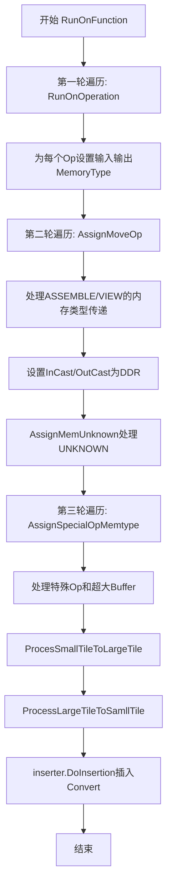

# Pass 分析文档：AssignMemoryType

## 1. Pass 概述

- **Pass名称**：AssignMemoryType
- **Pass类型**：Tile Graph Pass
- **简要描述**：为 Tile Graph 中的所有 Tensor 分配内存类型（MemoryType），包括 L0A、L0B、L0C、L1、UB、DDR 等，并在必要时插入 Convert Op 以处理内存类型冲突。

## 2. 代码分析

### 2.1 主要功能

**核心问题**：
- Tile Graph 中的 Tensor 在生成时可能未确定其所在的内存层级
- 不同操作对输入输出的内存类型有特定要求
- 数据在不同内存层级之间传输需要插入相应的搬运操作

**主要处理目标**：
1. 根据 Opcode 定义为每个 Op 的输入输出 Tensor 设置 MemoryTypeOriginal
2. 维护 Tensor 的 tobeMap，记录每个消费者 Op 所需的内存类型
3. 处理 VIEW、ASSEMBLE、RESHAPE 等特殊 Op 的内存类型传递
4. 处理超大 Local Buffer 的降级（UB/L1 → DDR）
5. 处理 Cube 级联场景的小搬大/大搬小约束
6. 插入 Convert Op 解决内存类型冲突

**输入输出特点**：
- 输入：Tile Graph（Function），其中 Tensor 的 MemoryTypeOriginal 可能为 MEM_UNKNOWN
- 输出：Tile Graph，所有 Tensor 的 MemoryTypeOriginal 已确定，并插入了必要的 Convert Op

### 2.2 处理流程

#### 2.2.1 PreCheck 阶段

PreCheck 由 `AssignMemoryTypeChecker::DoPreCheck` 执行，主要检查：

1. **A_MUL_B 输入生产者校验**：
   - 检查 A_MUL_B 操作的输入 Tensor 的生产者是否合法
   - 合法的生产者包括：OP_L1_TO_L0A、OP_L1_TO_L0B、OP_L1_TO_L0AT、OP_L1_TO_L0BT、OP_VIEW、OP_VEC_DUP
   - 如果生产者是 OP_VIEW，还需检查 View 的 toType 是否为 MEM_BT、MEM_FIX_QUANT_PRE、MEM_L0A、MEM_L0B 或 MEM_UNKNOWN

2. **VIEW/ASSEMBLE/RESHAPE 嵌套深度检查**：
   - 使用 BFS 遍历检查连续的 VIEW/ASSEMBLE/RESHAPE 嵌套深度
   - 如果嵌套深度超过 3 层，输出警告但不阻止执行

#### 2.2.2 RunOnFunction 阶段

**入口函数**：`AssignMemoryType::RunOnFunction`

**主要流程**：

1. **第一轮遍历 - RunOnOperation**：
   - 遍历所有 Operation，调用 `RunOnOperation` 为每个 Op 的输入输出 Tensor 设置初始 MemoryType
   - 根据 OpcodeManager 中定义的输入输出内存类型进行设置
   - 对 MATMUL 类型的 Op 调用 `ProcessAmulBInput` 特殊处理

2. **第二轮遍历 - AssignMoveOp**：
   - 遍历所有 Operation，调用 `AssignMoveOp` 处理 ASSEMBLE 和 VIEW 的内存类型传递
   - `AssignMoveOpForAssemble`：将 ASSEMBLE 输出的 MemoryTypeOriginal 设置为输入的 MemoryType
   - `AssignMoveOpForView`：更新 VIEW 输入 Tensor 的 tobeMap

3. **处理 InCast/OutCast**：
   - 将 InCast 的 MemoryType 设置为 DDR，更新其消费者到 tobeMap
   - 将 OutCast 的 MemoryType 设置为 DDR

4. **AssignMemUnknown**：
   - 处理所有 MemoryTypeOriginal 仍为 MEM_UNKNOWN 的 Tensor
   - 如果 tobeMap 中只有一种非 UNKNOWN 类型，则使用该类型；否则默认为 DDR

5. **第三轮遍历 - AssignSpecialOpMemtype**：
   - 处理 RESHAPE、VIEW_TYPE、NOP、REDUCE_ACC、SHMEM_WAIT_UNTIL、ASSEMBLE 等特殊 Op
   - 对 ASSEMBLE 检查输出是否超过阈值，超过则降级为 DDR

6. **处理 Cube 级联场景**：
   - `ProcesSmallTileToLargeTile`：处理小 Tile 搬到大 Tile 的场景
   - `ProcessLargeTileToSamllTile`：处理大 Tile 搬到小 Tile 的场景

7. **插入 Convert Op**：
   - 调用 `inserter.DoInsertion` 根据记录的冲突插入 Convert Op

#### 2.2.3 PostCheck 阶段

PostCheck 由 `AssignMemoryTypeChecker::DoPostCheck` 执行，主要检查：

1. **CheckTensorNotMemUnknown**：
   - 确保所有 Tensor 的 MemoryTypeOriginal 不再是 MEM_UNKNOWN

2. **CheckMoveOpReachable**：
   - 检查所有 MOVE_LOCAL 类型 Op 的输入输出内存类型路径是否可达
   - 可达路径由 `ALL_DEFINED_PATHS` 常量定义

#### 2.2.4 关键函数的核心逻辑

**函数1：RunOnOperation**
- **功能**：为单个 Operation 的输入输出 Tensor 设置 MemoryType
- **输入**：Operation 对象引用
- **输出**：无（直接修改 Tensor 的 MemoryTypeOriginal 和 tobeMap）
- **算法复杂度**：O(n)，n 为该 Op 的输入输出 Tensor 数量
- **核心逻辑**：
  1. 从 OpcodeManager 获取输入输出内存类型定义
  2. 对每个输入 Tensor 设置 MemoryTypeOriginal 并更新 tobeMap
  3. 对每个输出 Tensor 设置 MemoryTypeOriginal 并更新其所有消费者的 tobeMap
  4. 对 VIEW 和 ASSEMBLE 进行特殊处理

**函数2：AssignMoveOpForAssemble**
- **功能**：为 ASSEMBLE Op 设置输出的 MemoryType
- **输入**：Operation 对象引用
- **输出**：无
- **算法复杂度**：O(n)，n 为 ASSEMBLE 的输出 Tensor 及其生产者数量
- **核心逻辑**：
  1. 获取输入 Tensor 的 tobeMap 中的内存类型
  2. 检查所有生产者的 offset 是否 32B 对齐
  3. 如果不对齐，将输出类型设为 DDR
  4. 设置 ASSEMBLE 的 AssembleOpAttribute 的 fromType

**函数3：AssignMoveOpForView**
- **功能**：为 VIEW Op 更新输入 Tensor 的 tobeMap
- **输入**：Operation 对象引用
- **输出**：无
- **算法复杂度**：O(n)，n 为 VIEW 的输入 Tensor 数量
- **核心逻辑**：
  1. 检查 VIEW 是否有显式指定的 toType
  2. 检查 offset 是否对齐
  3. 根据输出 Tensor 的 MemoryTypeOriginal 更新输入的 tobeMap
  4. 处理 L0C→L1 特殊通路

**函数4：ProcessAmulBInput**
- **功能**：为 A_MUL_B 类型的 Op 处理输入 Tensor 的内存类型
- **输入**：Operation 引用，LogicalTensorPtr 引用
- **输出**：无
- **算法复杂度**：O(n)，n 为输入 Tensor 的生产者数量
- **核心逻辑**：
  1. 检查生产者 Op 类型
  2. 如果是 MATMUL 类型，设置输入为 L0C
  3. 如果是 VIEW，使用 VIEW 的 toType
  4. 如果是 L1→L0A/L0B 的搬运，设置相应类型
  5. 其他情况默认 DDR

**函数5：AssignMemUnknown**
- **功能**：处理所有 MemoryTypeOriginal 为 UNKNOWN 的 Tensor
- **输入**：Function 对象引用
- **输出**：无
- **算法复杂度**：O(n×m)，n 为 Op 数量，m 为每个 Op 的输入输出 Tensor 数量
- **核心逻辑**：
  1. 遍历所有 Op 的输入输出 Tensor
  2. 对于 UNKNOWN 的 Tensor，检查其 tobeMap
  3. 如果 tobeMap 只有一种非 UNKNOWN 类型，使用该类型
  4. 否则默认使用 DDR

**函数6：ProcesSmallTileToLargeTile / ProcessLargeTileToSamllTile**
- **功能**：处理 Cube 级联场景的维度约束
- **输入**：Function 对象引用
- **输出**：无
- **算法复杂度**：O(n)，n 为 Function 中的 Op 数量
- **核心逻辑**：
  1. 检查 ASSEMBLE（小搬大）或 VIEW（大搬小）场景
  2. 检查维度是否满足整除关系
  3. 如果不满足约束，将 Tensor 降级为 DDR

#### 2.2.5 核心流程图



文字描述核心流程：
1. **第一轮遍历**：为每个 Operation 的输入输出 Tensor 设置初始 MemoryTypeOriginal
2. **第二轮遍历**：处理 ASSEMBLE 和 VIEW 的内存类型传递关系
3. **InCast/OutCast 处理**：设置入口/出口 Tensor 为 DDR 类型
4. **AssignMemUnknown**：将所有仍为 UNKNOWN 的 Tensor 设置为具体类型
5. **特殊 Op 处理**：处理 RESHAPE、NOP、REDUCE_ACC 等特殊场景
6. **Cube 级联处理**：处理小搬大和大搬小的维度约束
7. **插入 Convert**：根据内存类型冲突插入转换操作

## 3. 业务分析

### 3.1 适用场景

- **Tile Graph 编译阶段**：在 Tile Graph 生成后，需要确定所有 Tensor 的内存位置
- **多级内存架构**：NPU 具有 L0A、L0B、L0C、L1、UB、DDR 等多级内存，需要明确数据存放位置
- **内存类型冲突**：当 Tensor 的当前内存类型与消费者期望不一致时，需要插入搬运操作

### 3.2 优化效果

- **明确内存位置**：为所有 Tensor 确定内存类型，为后续代码生成提供基础
- **减少内存搬运**：通过合理分配内存类型，减少不必要的数据搬运
- **处理特殊场景**：自动处理对齐、超大 Buffer、级联等特殊场景
- **内存路径可达性**：确保所有搬运操作的路径在硬件上可达

### 3.3 典型应用场景

**场景1：常规计算 Op 的内存类型分配**

- **场景描述**：一个标准的 MATMUL 操作，输入来自 L1，输出到 L0C
- **输入图结构**：
  ```
  InCast[Tensor_A, DDR] --> L1_TO_L0A[Tensor_B, L1→L0A] --> A_MUL_B
  InCast[Tensor_C, DDR] --> L1_TO_L0B[Tensor_D, L1→L0B] --> A_MUL_B --> Tensor_E[UNKNOWN]
  ```
- **输出图结构**：
  ```
  InCast[Tensor_A, DDR] --> L1_TO_L0A[Tensor_B, L1→L0A] --> A_MUL_B
  InCast[Tensor_C, DDR] --> L1_TO_L0B[Tensor_D, L1→L0B] --> A_MUL_B --> Tensor_E[L0C]
  ```
- **优化效果**：Tensor_E 的内存类型从 UNKNOWN 变为 L0C，符合 MATMUL 输出的要求

**场景2：ASSEMBLE 操作的内存类型传递**

- **场景描述**：多个小 Tensor 通过 ASSEMBLE 组装成大 Tensor
- **输入图结构**：
  ```
  Op1 --> Tensor_A[UB] --> ASSEMBLE --> Tensor_B[UNKNOWN]
  Op2 --> Tensor_C[UB] --> ASSEMBLE --> Tensor_B[UNKNOWN]
  Op3 --> Tensor_D[UB] --> ASSEMBLE --> Tensor_B[UNKNOWN]
  ```
- **输出图结构**：
  ```
  Op1 --> Tensor_A[UB] --> ASSEMBLE --> Tensor_B[UB]
  Op2 --> Tensor_C[UB] --> ASSEMBLE --> Tensor_B[UB]
  Op3 --> Tensor_D[UB] --> ASSEMBLE --> Tensor_B[UB]
  ```
- **优化效果**：ASSEMBLE 的输出继承了输入的内存类型（如果对齐满足要求）

**场景3：超大 Buffer 降级处理**

- **场景描述**：ASSEMBLE 输出的 Tensor 大小超过 UB 阈值（35%）
- **输入图结构**：
  ```
  Op --> Tensor_A[UB] --> ASSEMBLE --> Tensor_B[UB, size > threshold]
  ```
- **输出图结构**：
  ```
  Op --> Tensor_A[UB] --> ASSEMBLE --> Tensor_B[DDR]
  ```
- **优化效果**：自动将超大 Buffer 降级为 DDR，避免 UB 溢出

**场景4：内存类型冲突插入 Convert**

- **场景描述**：一个 Tensor 被多个 Op 消费，且消费者期望不同的内存类型
- **输入图结构**：
  ```
  Op1 --> Tensor_A[L1] --> Op2[期望L1]
  Tensor_A[L1] --> Op3[期望UB]
  ```
- **输出图结构**：
  ```
  Op1 --> Tensor_A[L1] --> Op2
  Tensor_A[L1] --> Convert[L1→UB] --> Tensor_B[UB] --> Op3
  ```
- **优化效果**：自动插入 Convert Op 解决内存类型冲突

## 4. OPCode 特判分析

**视图类 OPCode**：

- **OP_VIEW**
  - **特判条件**：`operation.GetOpcode() == Opcode::OP_VIEW`
  - **特判位置**：RunOnOperation、AssignMoveOp、AssignMoveOpForView、ProcessViewwithSpecificMem、ProcessLargeTileToSamllTile
  - **处理逻辑**：
    - 在 RunOnOperation 中调用 ProcessViewwithSpecificMem 处理显式指定的内存类型
    - 在 AssignMoveOp 中调用 AssignMoveOpForView 更新输入 Tensor 的 tobeMap
    - 处理 L0C→L1 特殊通路
    - 检查 offset 对齐，不对齐时需要走 DDR

- **OP_ASSEMBLE**
  - **特判条件**：`operation.GetOpcode() == Opcode::OP_ASSEMBLE`
  - **特判位置**：RunOnOperation、AssignMoveOp、AssignMoveOpForAssemble、ProcessAssemblewithSpecificMem、ProcesSmallTileToLargeTile、UpdateOverSizedLocalBuffer
  - **处理逻辑**：
    - 在 RunOnOperation 中调用 ProcessAssemblewithSpecificMem 处理 L0C→L1 场景
    - 在 AssignMoveOp 中调用 AssignMoveOpForAssemble 传递内存类型
    - 检查 offset 是否 32B 对齐
    - 检查输出是否超过 UB/L1 阈值
    - 处理 Cube 级联的小搬大场景

- **OP_RESHAPE**
  - **特判条件**：`op.GetOpcode() == Opcode::OP_RESHAPE`
  - **特判位置**：AssignOpReshapeMemtype、AssignMemtypeForSplitReshape、CheckPattern
  - **处理逻辑**：
    - 如果输入输出的 MemoryType 不一致，统一设置为 DDR
    - 处理 SplitReshape 场景（ASSEMBLE 后接 RESHAPE 后接 VIEW）

**其他 OPCode 特判**：

- **OP_A_MUL_B / OP_A_MULACC_B**
  - **特判条件**：`OpChecker::check(operation, OpChecker::CalcTypeChecker(OpCalcType::MATMUL))`
  - **特判位置**：RunOnOperation、ProcessAmulBInput、CheckAmulBInputProducers
  - **处理逻辑**：根据输入 Tensor 的生产者类型设置输入的内存类型

- **OP_VIEW_TYPE**
  - **特判条件**：`op.GetOpcode() == Opcode::OP_VIEW_TYPE`
  - **特判位置**：AssignOpViewTypeMemtype
  - **处理逻辑**：类似 RESHAPE，如果输入输出 MemoryType 不一致则设为 DDR

- **OP_NOP**
  - **特判条件**：`op.GetOpcode() == Opcode::OP_NOP`
  - **特判位置**：AssignOpNopMemtype
  - **处理逻辑**：NOP 不改变内存类型，输入输出保持一致

- **OP_REDUCE_ACC**
  - **特判条件**：`op.GetOpcode() == Opcode::OP_REDUCE_ACC`
  - **特判位置**：AssignSpecialOpMemtype
  - **处理逻辑**：所有输入都设置为 DDR（由 Ksplit 决定输入数量）

- **OP_SHMEM_WAIT_UNTIL**
  - **特判条件**：`op.GetOpcode() == Opcode::OP_SHMEM_WAIT_UNTIL`
  - **特判位置**：AssignSpecialOpMemtype
  - **处理逻辑**：所有输出设置为 DDR

- **OP_L1_TO_L0A / OP_L1_TO_L0B / OP_L1_TO_L0AT / OP_L1_TO_L0BT / OP_VEC_DUP**
  - **特判条件**：在 CheckAmulBInputProducers 中检查
  - **特判位置**：CheckAmulBInputProducers
  - **处理逻辑**：这些是 A_MUL_B 的合法输入生产者

## 5. 总结

**核心价值**：
AssignMemoryType 是 Tile Graph 编译的关键 Pass，负责为所有 Tensor 确定内存类型，为后续的代码生成和执行提供基础。通过合理的内存类型分配，可以优化数据搬运路径，提高执行效率。

**主要特点**：
1. 基于 Opcode 定义的标准内存类型分配
2. 处理 VIEW/ASSEMBLE/RESHAPE 的特殊语义
3. 支持超大 Buffer 自动降级
4. 支持 Cube 级联场景的约束处理
5. 自动插入 Convert Op 解决内存冲突

**使用建议**：
- 确保 OpcodeManager 中正确定义各 Op 的输入输出内存类型
- 对于特殊的 VIEW 操作，可通过 toType 属性显式指定目标内存类型
- 注意 ASSEMBLE 的 offset 对齐问题，不对齐时会强制走 DDR

**适用范围**：
Tile Graph 编译阶段，在 InferMemoryConflict、MergeViewAssemble 等优化 Pass 之后执行。

## 6. 相关文件

**主要实现文件**：
- `framework/src/passes/tile_graph_pass/data_path/assign_memory_type.h`：Pass 头文件，定义类接口
- `framework/src/passes/tile_graph_pass/data_path/assign_memory_type.cpp`：Pass 主实现文件

**辅助文件**：
- `framework/src/passes/pass_check/assign_memory_type_checker.h`：PreCheck/PostCheck 检查器头文件
- `framework/src/passes/pass_check/assign_memory_type_checker.cpp`：PreCheck/PostCheck 检查器实现
- `framework/src/passes/tile_graph_pass/data_path/convert_op_inserter.h`：Convert Op 插入辅助类头文件
- `framework/src/passes/tile_graph_pass/data_path/convert_op_inserter.cpp`：Convert Op 插入辅助类实现
- `framework/src/passes/pass_interface/pass_type.h`：PassName 枚举定义
- `framework/src/passes/pass_mgr/pass_manager.cpp`：Pass 注册和策略配置

## 7. 附录

### 7.1 术语表

| 术语 | 说明 |
|------|------|
| MemoryType | 内存类型，包括 L0A、L0B、L0C、L1、UB、DDR 等 |
| MemoryTypeOriginal | Tensor 的原始内存类型，表示数据实际存放位置 |
| tobeMap | 记录每个消费者 Op 期望的内存类型映射 |
| Convert Op | 内存类型转换操作，用于在不同内存层级间搬运数据 |
| InCast/OutCast | 图的输入/输出节点 |
| Cube 级联 | 多个 Cube 操作通过 ASSEMBLE/VIEW 连接的场景 |
| UB_THRESHOLD | UB 内存使用阈值，默认 0.35（35%） |
| L1_THRESHOLD | L1 内存使用阈值，默认 0.5（50%） |

### 7.2 参考资料

- `docs/api/` 目录下的 API 文档
- `examples/` 目录下的示例代码

### 7.3 修改历史

- 2026/03/18：初始版本，基于代码分析生成

## 8. 能力边界

### 8.1 支持的场景

| 场景ID | 场景描述 | 约束条件 | 典型Case |
|--------|----------|----------|----------|
| S001 | 常规MATMUL内存类型分配 | 输入来自L1，输出到L0C | examples/03_advanced/advanced_nn/attention/attention.py |
| S002 | ASSEMBLE内存类型传递 | offset 32B对齐 | Cube级联场景 |
| S003 | VIEW内存类型传递 | toType合法 | 大搬小场景 |
| S004 | Cube级联小搬大 | 维度整除关系 | models/deepseek_v32_exp/ |
| S005 | Cube级联大搬小 | 维度整除关系 | models/deepseek_v32_exp/ |
| S006 | 超大Buffer降级 | 输出超过阈值时自动降DDR | 大Tensor场景 |

### 8.2 不支持/有风险的场景

| 场景ID | 场景描述 | 原因 | 规避方案 |
|--------|----------|------|----------|
| R001 | offset未32B对齐的ASSEMBLE | 强制走DDR，性能下降 | 调整offset确保对齐 |
| R002 | VIEW/ASSEMBLE/RESHAPE嵌套超过3层 | PreCheck警告，可能影响性能 | 重构IR结构减少嵌套 |
| R003 | A_MUL_B输入Producer不合法 | PreCheck失败 | 确保输入来自L1_TO_L0A/L0B或VIEW |
| R004 | 内存路径不可达 | PostCheck失败 | 检查Move操作的源/目标MemoryType |
| R005 | 动态Shape无法推断 | MEM_UNKNOWN无法确定 | 显式指定MemoryType或检查tobeMap |

### 8.3 边界约束条件

| 约束ID | 约束项 | 阈值/条件 | 超出后果 | 检测方法 |
|--------|--------|-----------|----------|----------|
| C001 | ASSEMBLE offset对齐 | 32B对齐 | 强制走DDR | PreCheck: CheckAmulBInputProducers |
| C002 | VIEW/ASSEMBLE嵌套深度 | ≤3层 | 警告，可能性能下降 | PreCheck: BFS遍历检查 |
| C003 | UB内存使用阈值 | 35% | ASSEMBLE输出降级DDR | AssignSpecialOpMemtype |
| C004 | L1内存使用阈值 | 50% | ASSEMBLE输出降级DDR | AssignSpecialOpMemtype |
| C005 | 小搬大维度整除 | 大Tile维度/小Tile维度∈Z | 降级DDR | ProcesSmallTileToLargeTile |
| C006 | 内存路径可达性 | 源→目标必须在ALL_DEFINED_PATHS中 | PostCheck失败 | PostCheck: CheckMoveOpReachable |

### 8.4 常见错误模式

| 错误ID | 错误现象 | 根因 | 定位方法 | 修复方案 |
|--------|----------|------|----------|----------|
| E001 | ASSEMBLE输出被强制走DDR | offset未32B对齐 | 检查AssembleOpAttribute的offset | 调整offset确保对齐 |
| E002 | 嵌套深度超过3层警告 | VIEW/ASSEMBLE嵌套过深 | 查看日志警告 | 重构IR结构减少嵌套 |
| E003 | A_MUL_B输入PreCheck失败 | 输入Producer类型不合法 | 检查Producer Op类型 | 确保输入来自L1_TO_L0A/L0B或VIEW |
| E004 | MemoryType仍为UNKNOWN | tobeMap冲突或无法推断 | 检查tobeMap内容 | 显式指定MemoryType或修复Consumer期望 |
| E005 | PostCheck内存路径不可达 | Move操作路径不在预定义路径中 | 检查Move的fromType/toType | 检查ALL_DEFINED_PATHS，修复内存类型 |

### 8.5 与其他Pass的交互

| 关联Pass | 关系类型 | 交互说明 |
|----------|----------|----------|
| MergeViewAssemble | 前置 | MergeViewAssemble合并VIEW/ASSEMBLE后再分配内存类型 |
| InferMemoryConflict | 前置 | 推断内存冲突信息，影响内存类型选择 |
| GenerateMoveOp | 后置 | 根据AssignMemoryType的结果插入Move操作 |
| IntraSubgraphAdapter | 后置 | 可能需要调整数据布局以适应内存类型 |
| SplitReshape | 前置 | RESHAPE拆分后再分配内存类型 |
| GraphPartition | 后置 | 内存类型分配后再进行子图划分 |
